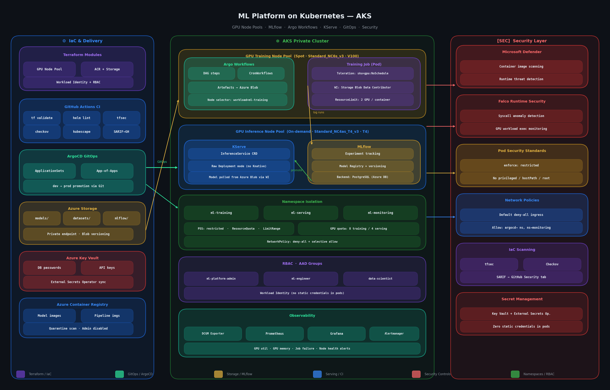

# ml-platform-k8s

Production-grade ML platform on Azure Kubernetes Service (AKS) — built from the ground up as a Platform Engineer learning how ML workloads actually run in production.

This isn't a data science project. It's the infrastructure and platform layer that data scientists and ML engineers sit on top of — GPU node pools, model tracking, pipeline orchestration, model serving, GitOps delivery, and security controls.

---

## Why I Built This

I've spent years building platforms on AWS and GCP. When I started exploring Azure, I wanted to understand what a proper ML workload setup looks like — not just "spin up a VM with a GPU" but the full picture: how do you manage GPU costs, how do you get models from training into serving safely, how do you make sure data scientists can work without opening up the whole cluster?

This repo is what I learned by building it.

---

## Architecture



### Three layers

**IaC & Delivery** — Terraform modules for GPU node pools (split into spot for training, on-demand for inference), Azure Blob Storage (models, datasets, MLflow artefacts), ACR with quarantine scanning. GitHub Actions pipeline runs `terraform validate`, `helm lint`, `tfsec`, `checkov`, and `kubescape` on every PR. ArgoCD handles GitOps delivery with ApplicationSets across environments.

**AKS Private Cluster** — Two GPU node pools with different priorities and VM sizes. Argo Workflows orchestrates training pipelines. MLflow handles experiment tracking and model registry (backed by PostgreSQL + Azure Blob). KServe serves models in Raw Deployment mode (no Knative dependency). Three isolated namespaces (`ml-training`, `ml-serving`, `ml-monitoring`) with Pod Security Standards, ResourceQuotas, GPU limits, and network policies.

**Security Layer** — Microsoft Defender for Containers, Falco for runtime syscall monitoring, Pod Security Standards enforced at namespace level, default-deny NetworkPolicies, IaC scanning (tfsec + Checkov → SARIF), and zero static credentials in pods (Workload Identity throughout).

---

## Stack

| Layer | Tool | Notes |
|---|---|---|
| Infrastructure | Terraform | GPU node pools, storage, ACR, managed identity |
| Container Orchestration | AKS | Private cluster, Workload Identity, AAD integration |
| Pipeline Orchestration | Argo Workflows | DAG-based ML pipelines, artefacts to Azure Blob |
| Experiment Tracking | MLflow | PostgreSQL backend, Azure Blob artefact store |
| Model Serving | KServe v0.13 | Raw Deployment mode, InferenceService CRD |
| GPU Monitoring | DCGM Exporter | GPU util, memory, power — fed into Prometheus |
| Observability | Prometheus + Grafana | GPU alerts, job failure alerts |
| GitOps | ArgoCD + ApplicationSets | App-of-apps pattern, dev → prod via Git |
| Secret Management | Key Vault + External Secrets Op. | No secrets in manifests or environment variables |
| Runtime Security | Falco | Syscall anomaly detection on GPU workloads |
| IaC Scanning | tfsec + Checkov + Kubescape | SARIF output to GitHub Security tab |
| CI | GitHub Actions | PR-gated validate, lint, scan |

---

## Repo Structure

```
ml-platform-k8s/
├── terraform/
│   ├── modules/
│   │   ├── gpu-nodepool/      # Training (Spot/V100) + Inference (On-demand/T4)
│   │   ├── storage/           # Azure Blob — models, datasets, mlflow artefacts
│   │   └── acr/               # Container registry — quarantine scan, admin disabled
│   └── environments/
│       ├── dev/
│       └── prod/
├── platform/
│   ├── helm/
│   │   ├── mlflow/            # Experiment tracking + model registry
│   │   ├── argo-workflows/    # ML pipeline orchestration
│   │   ├── kserve/            # Model serving (Raw Deployment mode)
│   │   └── dcgm-exporter/     # GPU metrics for Prometheus
│   └── namespaces/
│       ├── ml-training/       # Namespace + ResourceQuota + GPU limits
│       ├── ml-serving/        # Namespace + ResourceQuota
│       └── ml-monitoring/     # Prometheus alerts — GPU util, OOM, node health
├── gitops/
│   ├── apps/                  # ArgoCD Application per service
│   └── appsets/               # ApplicationSet — multi-env deployment
├── rbac/
│   ├── ml-engineer-role.yaml      # Workflow + InferenceService management
│   ├── data-scientist-role.yaml   # Submit workflows, read-only on infra
│   └── platform-admin-role.yaml   # Platform team — manage the platform itself
└── .github/workflows/
    ├── terraform-validate.yml
    └── security-scan.yml
```

---

## Key Design Decisions

**Spot for training, on-demand for inference**

Training jobs can handle interruption — they checkpoint to Azure Blob and resume. Spot nodes are significantly cheaper for V100/A100 capacity. Inference SLAs can't tolerate spot eviction, so serving runs on on-demand T4 nodes.

**KServe over Seldon Core**

Seldon Core v1 is deprecated. KServe is the CNCF-backed successor with active development. Raw Deployment mode removes the Knative dependency — simpler ops, fewer moving parts.

**Workload Identity throughout**

No service account keys or connection strings in pods. Every component (MLflow, Argo Workflows, KServe storage initialiser) uses Azure Workload Identity to access storage and Key Vault. If a pod is compromised, there are no credentials to exfiltrate.

**Namespace-level GPU quotas**

Without quotas, one runaway training job can consume all GPU capacity in the cluster. `requests.nvidia.com/gpu: "8"` in the training namespace ResourceQuota caps concurrent GPU usage. LimitRange caps per-container and per-pod GPU allocation.

**DCGM Exporter for GPU observability**

Standard Kubernetes metrics don't expose GPU utilisation. DCGM Exporter exposes NVIDIA-specific metrics (util%, VRAM used/free, power draw, SM clock) that let you catch stuck jobs, OOM risks, and idle GPU waste before they become expensive problems.

---

## What I'd Add Next

- [ ] Volcano scheduler for gang scheduling (multi-GPU distributed training)
- [ ] Ray Cluster operator for distributed model training
- [ ] Triton Inference Server runtime for high-throughput serving
- [ ] Spot interruption handler (drain gracefully, checkpoint to blob)
- [ ] Cost attribution dashboards per team/namespace
- [ ] Model drift monitoring with Evidently AI

---

## Related

- [aks-platform](https://github.com/SriLingala/aks-platform) — the AKS security baseline this builds on (Workload Identity, Key Vault, security scanning, Gateway API)
- [Platform Engineering vs DevOps — What the Shift Actually Means Day-to-Day](https://medium.com/@srilingala1) — my writing on building platforms for engineering teams

---

*Built by [Sri Lingala](https://www.linkedin.com/in/itsmesri/) — Senior Platform Engineer*
